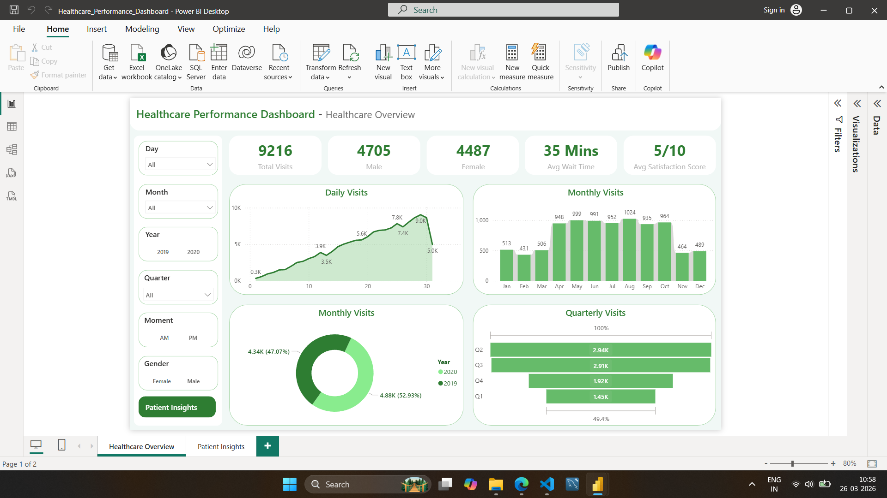
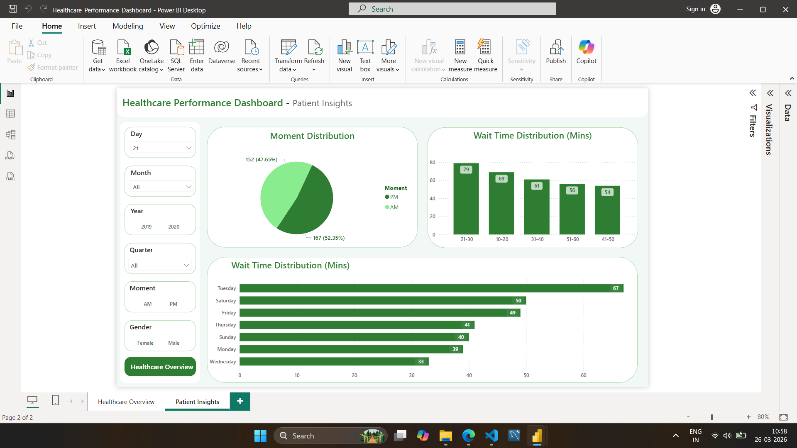

# 🏥 Healthcare Performance Dashboard

## 📌 Project Overview
This project is a Power BI dashboard built to analyze patient wait times, demographics, and satisfaction scores within a healthcare facility. It helps identify operational inefficiencies and improve patient experience using data-driven insights.

---

## 📊 Dataset Description

The project uses three datasets:

### 1. Patient Table (`patient_table.csv`)
- Patient demographics  
- Fields: Patient_Id, Full_Name, Patient_Age, Patient_Gender, Patient_Race, Age_Group  

### 2. Date & Time Table (`date_time_table.csv`)
- Visit timing and wait time analysis  
- Fields: Patient_Id, Date, Moment (AM/PM), Patient_Wait_Time, Day_Of_Week, Weekday/Weekend, Wait_Time_Bucket  

### 3. Activity Table (`activity_table.csv`)
- Administrative and feedback data  
- Fields: Patient_Id, Patient_Admin_Flag, Department_Referral, Satisfaction_Score  

---

## 📈 Dashboard Highlights

### Page 1: Healthcare Overview
- Total Visits, Gender Distribution  
- Daily & Monthly Visits Trend  
- Quarterly Analysis  
- Average Wait Time  
- Overall Satisfaction Score  

---

### Page 2: Patient Insights
- Wait Time Distribution by Age Group  
- Day-wise Wait Time Analysis  
- AM vs PM Visit Distribution  
- Patient Behavior Insights  

---

## 🛠️ Tools & Technologies
- Power BI  
- DAX (Data Analysis Expressions)  
- Power Query (Data Cleaning & Transformation)  
- CSV / Excel  

---

## 💡 Key Insights
- Peak patient visits occur during specific days and time periods  
- Average wait time impacts satisfaction score significantly  
- Certain age groups experience longer wait times  
- Patient distribution varies between AM and PM sessions  

---

## 🚀 How to Use

1. Download the `.pbix` file  
2. Open in Power BI Desktop  
3. Load dataset if required  
4. Explore dashboard using filters  
